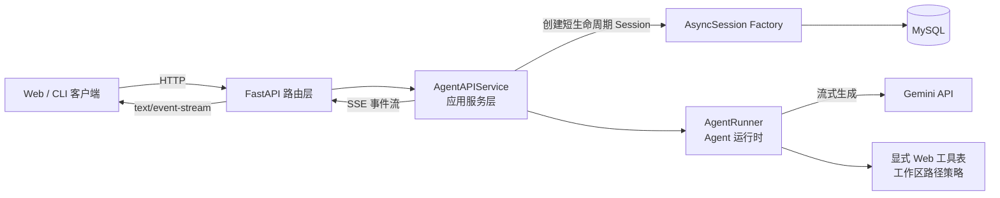
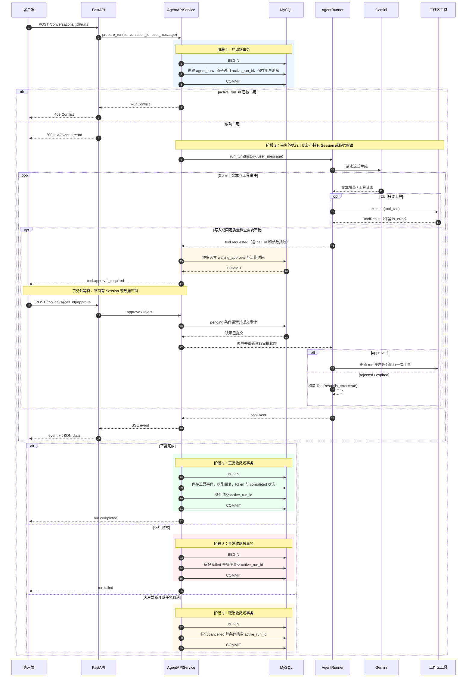
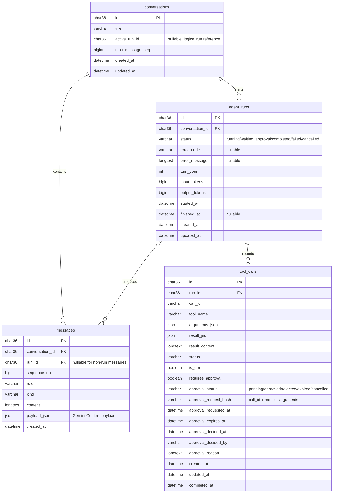

# Agent Service 架构说明

> 状态说明：本文描述当前阶段 2～4 实现及仍存在的安全边界。MySQL、迁移和容器
> 验证方式见 README；真实 Gemini 是否可用仍取决于本地 Key 与外部服务。

## 1. 组件关系



各层职责如下：

- **FastAPI 路由层**负责 HTTP 参数校验、状态码和 `StreamingResponse`，不承载 Agent 循环，也不把路由依赖注入的数据库 Session 传入整个流式生成过程。
- **AgentAPIService**协调会话、消息、run 状态与持久化。它持有 Session Factory，需要访问数据库时才创建 Session，并用短事务完成一次明确的写入。
- **AgentRunner**运行 Agent 循环，调用 Gemini、执行工具并产生运行事件；它不负责数据库事务。
- **SQLAlchemy 2.0 / MySQL**保存会话、消息、run 和工具调用记录。一个异步任务使用一个 `AsyncSession`，Session 不跨并发任务共享。
- **SSE**把运行事件逐条推送给客户端。非终态事件可以随生成过程发送；终态事件应在对应的最终状态已经持久化后发送。

Web API 默认显式注册 `list_files`、`read_file`，而不是自动收集所有
`read_only=True` 工具。文件工具统一经过 `WorkspacePathPolicy`。本地配置可额外
声明 `write_file`、`edit_file` 与固定动作的质量检查；这些工具必须逐次审批。
任意字符串的 `run_command` 不通过 Web API 暴露。

## 2. `POST /runs` 的短事务时序

`POST /api/v1/conversations/{conversation_id}/runs` 的核心原则是：数据库事务只覆盖数据库读写，不能覆盖等待 Gemini、等待工具或向客户端持续推流的时间。



这里的“三段”是启动短事务、事务外运行和收尾短事务；单次 run 只会走一种收尾分支。若工具事件需要在生成过程中立即持久化，每批工具事件也应使用独立的短事务，提交后立即释放 Session，不能把该 Session 留到下一次 Gemini 增量。

## 3. SSE 事件协议

响应媒体类型为 `text/event-stream`。每条事件包含事件名和一段 JSON 数据，例如：

```text
event: text.delta
data: {"run_id":"...","text":"你好"}

```

当前运行时事件类型包括：

- `text.delta`：模型文本增量。
- `tool.requested`：模型请求执行工具。
- `tool.approval_required`：工具调用已落库并进入 `pending`，包含调用标识与过期时间。
- `tool.completed`：工具执行结束；结果继续保留 `is_error`，使“工具返回错误”与“框架崩溃”可以区分。
- `run.completed`：run 已正常结束并完成最终持久化。
- `run.failed`：run 失败，数据中应提供适合 API 返回的错误信息。

客户端断开会触发流生成器的取消或清理逻辑。服务应使用新的短生命周期 Session 将 run 标记为 `cancelled`，而不是依赖最初请求中的 Session。取消清理不应继续向已经断开的连接写入事件。

## 4. 同一会话的并发控制

`conversations.active_run_id` 是会话级运行占用标记。创建 run 时通过一条带条件的原子更新抢占会话：

```sql
UPDATE conversations
SET active_run_id = :run_id
WHERE id = :conversation_id
  AND active_run_id IS NULL;
```

- 受影响行数为 `1`：当前请求获得执行权，可以在同一短事务内保存 run 与用户消息。
- 受影响行数为 `0`：会话不存在或已经有活跃 run。服务先区分不存在场景；并发冲突映射为 `409 Conflict`。
- run 完成、失败或取消时，使用 `WHERE active_run_id = :run_id` 的条件更新清理占用，避免旧 run 清掉新 run 的占用标记。
- 若进程硬退出，下一次竞争请求可以回收 `started_at` 已超过运行超时上限的旧 run，并将其标记为 `RunExpired`。这是当前单节点的超时租约；扩展为多副本前仍应增加显式 `lease_expires_at` 与 heartbeat。

该方案依赖 MySQL 的原子条件更新，不需要在 Gemini 生成期间持有 `SELECT ... FOR UPDATE` 锁。等待模型、工具或用户审批时都不得持有数据库锁。

审批本身使用另一组 CAS：只有 `approval_status='pending'` 且尚未过期的记录能转为
`approved` 或 `rejected`；自动超时只能把仍为 `pending` 的记录转为 `expired`。
重复决定与批准/超时竞争只允许一个请求成功。审批接口只记录决定并唤醒原 run，不能
直接执行工具。`active_run_id` 在等待期间继续保留，所以同一会话的新 run 仍返回 409；
这只是逻辑占用，不是数据库锁。

## 5. 数据模型

下面是当前关系模型。`active_run_id` 主要承担并发租约语义；它不建立物理外键以避免
和 `agent_runs` 形成循环依赖，服务层仍必须执行上述原子条件更新。



建议的关键约束与索引：

- `messages (conversation_id, sequence_no)` 唯一，保证会话消息顺序稳定。
- `tool_calls (run_id, call_id)` 唯一，避免同一工具调用被重复记录。
- `agent_runs.conversation_id`、`messages.conversation_id` 和 `tool_calls.run_id` 建立查询索引。
- JSON 字段保存可重建的 Gemini 消息或工具载荷；`content` 等文本字段用于列表展示和检索，不能替代原始结构化载荷。

## 6. 运行与安全边界

- 本地开发默认只监听 `127.0.0.1`；Compose 即使让容器内进程监听所有接口，也只能把宿主机端口发布到 `127.0.0.1`。
- 即使已有审批和工作区路径限制，在认证、租户隔离与独立低权限工具 worker 完成前，
  也不向局域网或互联网公开 Agent run 服务。
- 健康检查拆分为 `live` 与 `ready`：`live` 只判断进程是否存活，`ready` 才检查数据库等必要依赖是否可用。健康检查不应创建长事务。
- 日志使用 `request_id`、`conversation_id` 和 `run_id` 关联一次请求、一个会话与一次执行；日志中不记录 API key、数据库密码或完整敏感提示词。

当前已经实现 `waiting_approval`、批准/拒绝接口、审批审计、超时拒绝、工作区路径
隔离和固定质量检查白名单。仍需明确以下边界：

- 工作区目前由本机所有会话共享，还不是用户/租户隔离。
- 运行中的审批依赖原 SSE 生产任务；进程重启后不能恢复到函数调用中间状态。要实现
  恢复，需要 Runtime checkpoint、事件 outbox 与可重连协议。
- 路径检查会拒绝 symlink/junction/reparse point，但无法抵御恶意本机进程在检查与
  打开文件之间并发替换路径的 TOCTOU 攻击。
- 固定 `ruff`/`pyright` argv 是白名单，不是操作系统沙箱；任意 `run_command` 始终
  不向 Web 开放。
- JWT、用户表、租户隔离、限流和独立低权限工具 worker 仍属于公网化前的后续能力。
- 真实 Gemini 仍需用户提供有效 Key 单独验证；本项目的 MySQL 升降级、竞争、审批、
  取消和 Compose 健康链路由 external 测试与 CI 验证。
