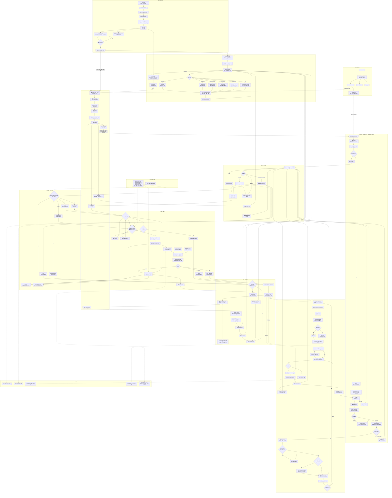

```mermaid
flowchart TD

    %% 启动与交互
    subgraph STARTUP["启动与用户交互"]
        A["python -m agent_service.main"]
        B["asyncio.run(main())"]
        C["async with AgentRunner()"]
        D["App(runner=runner)"]
        E["App.__init__()<br/>创建 PromptSession、RunCoordinator 和会话状态"]
        F["App.run()<br/>REPL 循环"]
        G["patch_stdout()<br/>PromptSession.prompt_async('>')"]
        H{"输入是否为空？"}
        I["App.run_turn(user_text)"]
        CLOSE["退出时 AgentRunner.close()<br/>关闭共享客户端"]

        A --> B --> C --> D --> E --> F --> G --> H
        H -->|"是"| G
        H -->|"否"| I
        F -. "退出时" .-> CLOSE
    end

    subgraph UI["UI 控制与状态：ui/app.py"]
        HIST["self.contents<br/>进程内对话历史"]
        INIT["初始化本轮状态<br/>full_text、current_plan、result"]
        LIVE["rich.Live<br/>备用屏幕、每秒刷新 15 次"]
        CONSUME["async for event<br/>消费 Coordinator 事件"]
        EVENT{"事件类型"}
        TEXT["text.delta<br/>追加到 full_text"]
        PLAN["plan.updated<br/>更新计划和提示"]
        REFLECT["reflection.updated<br/>更新反思状态提示"]
        TOOL_HINT["tool.requested<br/>显示工具或子代理状态"]
        BLOCK_UI["safety.blocked<br/>设置安全停止标记<br/>替换文本、清空计划"]
        TERMINAL_UI["run.completed / run.failed<br/>保存 result 和最终计划"]
        BUILD["_build_display_markdown()<br/>组合计划、文本、状态"]
        UPDATE["live.update(Markdown)"]
        SAVE["退出 Live 后<br/>self.contents = result.history<br/>Console 输出最终结果"]

        I --> INIT --> LIVE --> CONSUME --> EVENT
        EVENT -->|"text.delta"| TEXT
        EVENT -->|"plan.updated"| PLAN
        EVENT -->|"reflection.updated"| REFLECT
        EVENT -->|"tool.requested"| TOOL_HINT
        EVENT -->|"safety.blocked"| BLOCK_UI
        EVENT -->|"终态"| TERMINAL_UI
        TEXT --> BUILD
        PLAN --> BUILD
        REFLECT --> BUILD
        TOOL_HINT --> BUILD
        BLOCK_UI --> BUILD
        TERMINAL_UI --> BUILD
        BUILD --> UPDATE --> CONSUME
        CONSUME -->|"事件流结束"| SAVE --> F
        SAVE --> HIST
    end

    %% 协调器初始化
    subgraph COORD["运行协调：RunCoordinator.run_turn()"]
        CALL["接收 history、user_query<br/>permission_check"]
        CONTROL["创建 RunControl<br/>保存初始历史检查点"]
        STATE["创建 _RunState<br/>保存审核状态"]
        QUEUE["创建事件队列<br/>maxsize = 1"]
        GUARD["包装 guarded_permission()<br/>审批前后检查运行状态"]
        SPAWN["启动并发任务"]
        PRODUCER["Agent 生产任务<br/>produce()"]
        REVIEWER_TASK["安全审核任务<br/>_review()"]
        REJECT_WAIT["等待 rejected Event"]
        DISPATCH["协调循环<br/>等待事件、审核完成或拦截"]

        CALL --> CONTROL --> STATE --> QUEUE --> GUARD --> SPAWN
        SPAWN --> PRODUCER
        SPAWN --> REVIEWER_TASK
        SPAWN --> REJECT_WAIT
        SPAWN --> DISPATCH
    end

    I -->|"history、用户文本、审批回调"| CALL
    HIST -->|"history"| CALL

    %% 运行时
    subgraph RUNTIME["Runtime：AgentRunner 与 agentic_loop.query()"]
        RUNNER["AgentRunner.run_turn()"]
        USER_CONTENT["复制 history<br/>追加用户 types.Content"]
        COMPRESS["compress_context()<br/>必要时压缩历史"]
        COMPRESS_OK{"压缩是否成功？"}
        FAIL_EARLY["构造 run.failed"]
        QUERY["query()<br/>模型与工具异步循环"]
        PHASE["创建 ExecutionPlan<br/>planning / executing / reflecting"]
        TURN["模型循环<br/>默认最多 10 轮"]
        FILTER["按阶段筛选工具"]
        STREAM["stream_message()<br/>请求 Gemini 流式响应"]
        CHUNK{"模型流结果"}
        DELTA["StreamEvent.text<br/>转为 LoopEvent.text.delta"]
        DONE["message_done<br/>保存模型 parts、调用和用量"]
        HAS_CALL{"是否有工具调用？"}
        COMPLETE["满足结束条件<br/>产生 run.completed"]
        LIMIT["达到轮次上限<br/>产生 run.failed"]

        RUNNER --> USER_CONTENT --> COMPRESS --> COMPRESS_OK
        COMPRESS_OK -->|"否"| FAIL_EARLY
        COMPRESS_OK -->|"是"| QUERY --> PHASE --> TURN --> FILTER --> STREAM
        STREAM --> CHUNK
        CHUNK -->|"文本片段"| DELTA
        CHUNK -->|"完整响应"| DONE --> HAS_CALL
        HAS_CALL -->|"无，且满足结束条件"| COMPLETE
        TURN -->|"达到上限"| LIMIT
    end

    PRODUCER -->|"history、user_query<br/>受保护的审批回调、RunControl"| RUNNER

    %% 生产者与事件队列
    subgraph EVENTS["事件生产与转发"]
        READ["produce() 读取 Runner 事件<br/>ensure_running()"]
        TYPE{"事件类型"}
        FEED["text.delta<br/>state.feed(event.text)"]
        ENQUEUE["queue.put((event, ack))<br/>等待 ack"]
        FORWARD["协调循环 yield 事件"]
        ACK["消费者继续或关闭时<br/>ack.set()"]
        HOLD_FINAL["终态暂存到 state.final"]
        MODEL_DONE["生产任务结束<br/>model_done = True<br/>通知审核任务"]
        PROD_ERR["异常转为 run.failed"]

        READ --> TYPE
        TYPE -->|"text.delta"| FEED --> ENQUEUE
        TYPE -->|"普通事件"| ENQUEUE
        TYPE -->|"run.completed / run.failed"| HOLD_FINAL --> MODEL_DONE
        READ -->|"异常"| PROD_ERR --> MODEL_DONE
        ENQUEUE --> FORWARD --> ACK --> READ
    end

    DELTA --> READ
    FAIL_EARLY --> READ
    COMPLETE --> READ
    LIMIT --> READ
    DISPATCH --> FORWARD
    FORWARD --> CONSUME

    %% 工具与审批
    subgraph TOOLS["工具调用与 CLI 审批"]
        PARSE["解析 function_call<br/>工具名、参数、call_id"]
        PHASE_CHECK{"当前阶段是否禁止<br/>该非只读工具？"}
        PHASE_ERROR["返回阶段限制错误"]
        NEED_APPROVAL{"工具已开放且<br/>read_only = False？"}
        REQUEST["创建 ToolApprovalRequest<br/>绑定调用 ID、参数和指纹"]
        REQUEST_EVENT["产生 tool.requested<br/>包含 requires_approval"]
        WAIT_EVENT["等待消费者处理请求事件"]
        APPROVAL_BRANCH{"是否需要审批？"}
        BEFORE["guarded_permission()<br/>审批前 ensure_running()"]
        PERMISSION["App.permission_check(request)"]
        LOCK["获取审批锁<br/>暂停 Live"]
        ASK["显示工具名与参数<br/>prompt_async 等待 y/n"]
        USER_DECISION{"输入是否为 y？"}
        ALLOW["返回 True"]
        DENY["返回 False<br/>无回调时默认拒绝"]
        RESTORE["finally：未安全停止时恢复 Live"]
        AFTER["审批后再次 ensure_running()"]
        APPROVED["将获批 call_id 加入集合"]
        EXEC["execute_tools()<br/>检查白名单、工具和批准 ID"]
        EXEC_OK{"可以执行？"}
        DENIED_RESULT["返回 ToolResult 错误"]
        EXEC_GATE["执行前 ensure_running()"]
        RUN_TOOL["await tool.run(parameters)"]
        TOOL_DONE["产生 tool.completed"]
        STATE_EVENT["计划或反思工具成功时<br/>产生对应更新事件"]
        APPEND_RESULT["工具结果写入 history<br/>保存完整历史检查点"]

        HAS_CALL -->|"有"| PARSE --> PHASE_CHECK
        PHASE_CHECK -->|"禁止"| PHASE_ERROR --> TOOL_DONE
        PHASE_CHECK -->|"允许"| NEED_APPROVAL
        NEED_APPROVAL -->|"是"| REQUEST --> REQUEST_EVENT
        NEED_APPROVAL -->|"否"| REQUEST_EVENT
        REQUEST_EVENT --> WAIT_EVENT --> APPROVAL_BRANCH
        APPROVAL_BRANCH -->|"需要"| BEFORE --> PERMISSION
        PERMISSION --> LOCK --> ASK --> USER_DECISION
        USER_DECISION -->|"是"| ALLOW
        USER_DECISION -->|"否"| DENY
        ALLOW --> RESTORE
        DENY --> RESTORE
        RESTORE --> AFTER
        AFTER -->|"批准"| APPROVED --> EXEC
        AFTER -->|"拒绝"| EXEC
        APPROVAL_BRANCH -->|"不需要"| EXEC
        EXEC --> EXEC_OK
        EXEC_OK -->|"否"| DENIED_RESULT --> TOOL_DONE
        EXEC_OK -->|"是"| EXEC_GATE --> RUN_TOOL --> TOOL_DONE
        TOOL_DONE --> STATE_EVENT
        TOOL_DONE --> APPEND_RESULT --> TURN
    end

    REQUEST_EVENT --> READ
    TOOL_DONE --> READ
    STATE_EVENT --> READ

    %% 审核缓冲
    subgraph BUFFER["审核缓冲：_RunState"]
        FEED_CHECK{"新文本会使未审核字符数<br/>超过上限吗？"}
        OVERFLOW["SafetyReviewError<br/>审核缓冲区溢出"]
        PENDING["pending<br/>排队待审的新文本"]
        CONTEXT["context<br/>已审核文本的尾部上下文"]
        COUNT["unreviewed_chars<br/>排队与正在审核的总字符数"]
        TIME["pending_since<br/>当前批次开始时间"]
        CHANGED["changed Event<br/>通知审核任务"]
        FINAL["final<br/>暂存 Agent 终态"]

        FEED --> FEED_CHECK
        FEED_CHECK -->|"是"| OVERFLOW
        FEED_CHECK -->|"否"| PENDING
        FEED_CHECK -->|"否"| COUNT
        FEED_CHECK -->|"新批次"| TIME
        FEED_CHECK -->|"通知"| CHANGED
        HOLD_FINAL --> FINAL
        MODEL_DONE --> CHANGED
    end

    %% 审核调度与调用
    subgraph SAFETY["异步安全审核"]
        WAIT{"pending 是否为空？"}
        FINISHED{"Agent 是否结束？"}
        WAIT_CHANGE["等待 changed"]
        TRIGGER{"达到长度、等待时间<br/>或 Agent 已结束？"}
        WAIT_TIME["等待新文本或剩余时间"]
        BATCH["取出 pending 作为 batch<br/>清空 pending"]
        JOIN["送审内容 = context + batch"]
        CHECK["reviewer.check(text)<br/>单次请求设置超时"]
        GEMINI["GeminiTextReviewer<br/>复用客户端和配置模型"]
        PROMPT["safety_prompt.md<br/>待审文本作为数据"]
        SCHEMA["要求结构化 JSON<br/>verdict + category"]
        VALIDATE["检查完成原因和响应<br/>严格校验字段及语义一致性"]
        RESULT{"审核结果"}
        PASS["allow<br/>减少未审核字符数<br/>更新尾部上下文"]
        BLOCK["block<br/>SafetyBlockedError"]
        ERROR["error、异常或超时<br/>SafetyReviewError"]
        REVIEW_DONE["所有待审文本处理完成"]
        USAGE["累计 safety_usage"]

        REVIEWER_TASK --> WAIT
        WAIT -->|"是"| FINISHED
        FINISHED -->|"否"| WAIT_CHANGE --> WAIT
        FINISHED -->|"是"| REVIEW_DONE
        WAIT -->|"否"| TRIGGER
        TRIGGER -->|"否"| WAIT_TIME --> WAIT
        TRIGGER -->|"是"| BATCH --> JOIN --> CHECK
        CHECK --> GEMINI --> VALIDATE --> RESULT
        PROMPT --> GEMINI
        SCHEMA --> GEMINI
        RESULT -->|"allow"| PASS --> WAIT
        RESULT -->|"block"| BLOCK
        RESULT -->|"失败"| ERROR
        PASS --> USAGE
        PASS --> CONTEXT
        PASS --> COUNT
    end

    PENDING --> WAIT
    CONTEXT --> JOIN
    TIME --> TRIGGER
    CHANGED -. "唤醒" .-> WAIT

    subgraph CONFIG["当前审核默认配置"]
        CFG["chunk_chars = 800<br/>interval_seconds = 1.5<br/>timeout_seconds = 15<br/>context_chars = 1200<br/>max_buffer_chars = 16000"]
        TAIL["Agent 结束后审核剩余文本"]
    end

    CFG -.-> FEED_CHECK
    CFG -.-> TRIGGER
    CFG -.-> CHECK
    CFG -.-> PASS
    TAIL -.-> TRIGGER

    %% 拦截与终态
    subgraph ENDING["拦截、清理与终态"]
        REJECT["state.reject(error, category)"]
        STOP["stopped = True<br/>safety_stopped = True"]
        SIGNAL["通知 changed 和 rejected<br/>取消 Agent 生产任务"]
        INTERRUPT["取消中的任务可打断审批等待<br/>后续执行入口检查停止门闩"]
        CLEAN_HISTORY["_blocked_result()<br/>基于历史检查点构造失败结果"]
        SANITIZE["保留工具调用和响应 parts<br/>移除本次普通模型文本<br/>追加安全中止提示"]
        BLOCK_EVENT["产生 safety.blocked"]
        FAIL_EVENT["产生 run.failed"]
        FINAL_CHECK{"审核结束且<br/>存在 Agent 终态？"}
        MERGE["合并审核用量<br/>保留 safety_usage"]
        PUBLISH["发布原始 run.completed<br/>或 run.failed"]
        CLEANUP["取消并回收剩余任务"]

        OVERFLOW --> REJECT
        BLOCK --> REJECT
        ERROR --> REJECT
        REJECT --> STOP --> SIGNAL --> INTERRUPT
        SIGNAL --> REJECT_WAIT
        REJECT_WAIT --> CLEAN_HISTORY --> SANITIZE
        SANITIZE --> BLOCK_EVENT --> FAIL_EVENT --> CLEANUP
        REVIEW_DONE --> FINAL_CHECK
        FINAL --> FINAL_CHECK
        FINAL_CHECK -->|"是"| MERGE --> PUBLISH --> CLEANUP
        FINAL_CHECK -->|"否"| CLEANUP
    end

    STOP -. "停止检查" .-> BEFORE
    STOP -. "停止检查" .-> AFTER
    STOP -. "停止检查" .-> EXEC_GATE
    BLOCK_EVENT --> CONSUME
    FAIL_EVENT --> CONSUME
    PUBLISH --> CONSUME
    USAGE --> MERGE

    %% Web 复用与边界
    subgraph WEB["Web API 复用"]
        HTTP["POST /runs"]
        SERVICE["AgentAPIService<br/>数据库状态与审批等待"]
        WEB_COORD["RunCoordinator"]
        WEB_RUNNER["AgentRunner<br/>Web 工具注册表与白名单"]
        SSE["SSE 事件流"]
        DB["MySQL"]
        HTTP --> SERVICE --> WEB_COORD --> WEB_RUNNER
        SERVICE --> DB
        SERVICE --> SSE
    end

    WEB_COORD -. "复用协调与审核机制" .-> CALL
    WEB_RUNNER -. "复用 Runtime 接口" .-> RUNNER

    subgraph LIMITS["行为边界"]
        L1["文本可能先显示、后审核"]
        L2["终态等待尾部文本审核"]
        L3["审核期间工具可能已开始执行"]
        L4["已发生的副作用不能自动回滚"]
        L5["审核对象为 text.delta<br/>不等于审核所有输入、参数和工具输出"]
    end

    FEED -.-> L1
    HOLD_FINAL -.-> L2
    RUN_TOOL -.-> L3
    INTERRUPT -.-> L4
    CHECK -.-> L5
```